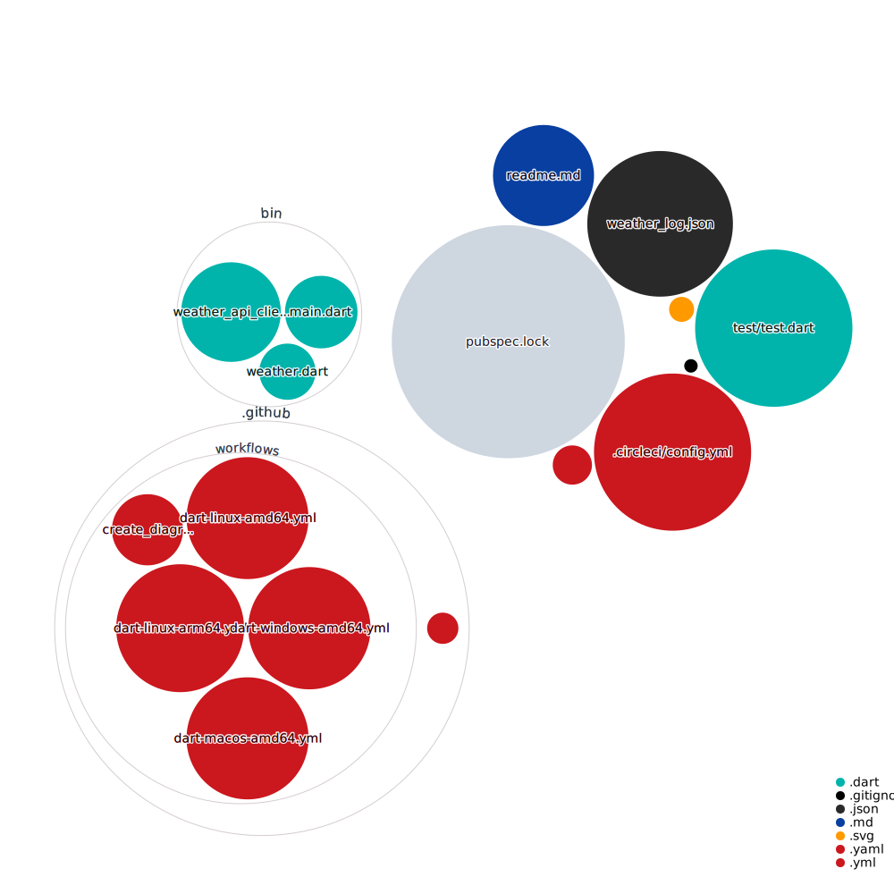

Weather Report App written in Dart
==========================

A Command Line Weather Report App Written in Dart Language

[](https://github.com/xros/weather_report_app/actions/workflows/dart-linux-amd64.yml)

[](https://github.com/xros/weather_report_app/actions/workflows/dart-macos-amd64.yml)

[](https://github.com/xros/weather_report_app/actions/workflows/dart-windows-amd64.yml)

Linux/ARM64[](https://circleci.com/gh/xros/weather_report_app/tree/main)

Usage
-----
For example, get Weather report of the city Berlin. In console, do `./weather_report.exe Berlin`

```
  City: Berlin
  Weather State: Light Cloud
  Max Temp: 3.73
  Min Temp: -0.29
  Current Temp: 2.96
```
Temperature unit is Celsius.

Build Binary
-----

`dart compile exe bin/main.dart -o weather_report.exe`

Show case
----------
Linux, MacOS, Windows


## Diagram of this software

